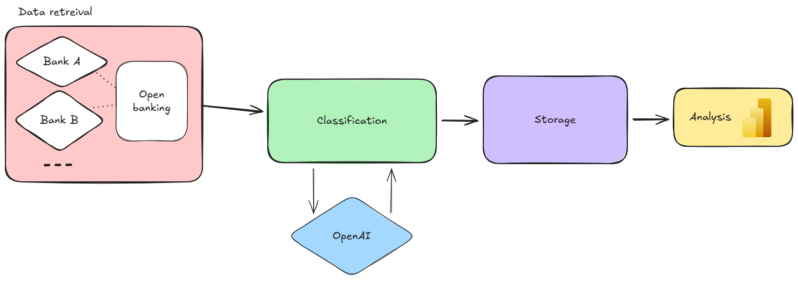

# Persoonlijke financien op orde

## Op zoek naar structuur

De inzet voor dit persoonlijk project is gekomen uit de vraag: waar gaat mijn geld naartoe, en ben ik wel goed bezig op financieel vlak? Om dit in kaart te brengen had ik nood aan data, zonder dat ik elke uitgave manueel moest bijhouden. Het systeem moest met weinig weerstand werken en mij een gedetailleerd, duidelijk overzicht geven van hoe mijn inkomsten en uitgaven eruitzien.

## Van waar kan data komen

Zo goed als al mijn uitgaven en inkomsten gebeuren tegenwoordig digitaal. Dit houdt dus in dat banken alle ruwe data al hebben. De moeilijkheid ligt alleen nog bij het extraheren van de transactiegegevens bij de gewenste partijen. Door de gevoeligheid en commerciële waarde van deze data staan banken niet te popelen om dit vrij te geven. Gelukkig is er hier de PSD2-wetgeving, die banken verplicht om derde partijen toegang te geven tot exact deze gegevens. Elke financiële instelling voorziet bijgevolg zijn eigen API waarmee gegevens opgehaald kunnen worden. Rechtstreeks hiermee verbinden is moeilijker dan gedacht, want niet iedereen kan zomaar deze rechten aanvragen. Om toch toegang te krijgen, heb ik beroep kunnen doen op verschillende tussenpartijen. Deze partijen hebben de connectie met de PSD2-endpoints van verschillende banken al geïmplementeerd, en bieden een gebundelde oplossing aan, zodat je als gebruiker 1 partij kan aanspreken en zo meerdere banken kan aanspreken. Dit bleek uiteindelijk de oplossing om dan toch alle uitgaven in een gestandaardiseerd formaat op te halen. De kostprijs voor deze tussenpartijen is op deze schaal beperkt, al weet je dat je dan betaalt met het afstaan van je eigen data.

## Classificeren van ruwe data

Om inzicht te krijgen in de ruwe data is het nodig om al deze transacties te classificeren in categorieën. Dit kan manueel gebeuren, maar vraagt veel werk. Een zelflerende aanpak was hier oorspronkelijk de oplossing voor. Zo zullen alle nieuwe transacties van bijvoorbeeld de Colruyt dezelfde categorie krijgen als voorgaande. Deze oplossing werkte goed voor herhalende transacties, maar komt tekort bij complexere scenario's. Om dit aan te pakken is gebruikgemaakt van AI om de classificatie uit te voeren. OpenAI biedt de mogelijkheid om op basis van bestaande modellen je eigen model te trainen. Hierbij heb ik een structuur vastgelegd waarmee elke transactie doorgestuurd zal worden en laat ik het aan het AI-model om de juiste categorie uit te kiezen. Zo worden mijn uitgaven in een Spaanse supermarkt ook onmiddellijk correct geclassificeerd.

## Visualiseren van data

Nu de grote hoeveelheid data geclassificeerd is, resteert enkel nog de taak om deze data te visualiseren. Hiervoor heb ik enkele Power BI-rapporten opgesteld die gebruikmaken van enkele slicers om de data te aggregeren over bepaalde tijdsperiodes en categorieën. Op deze manier kan ik steeds de meest recente data, zonder manuele interactie, bekijken en analyseren.

---

**Context:** Hobby project
